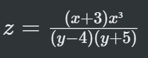
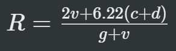
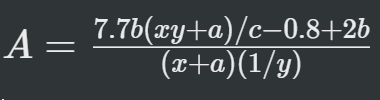
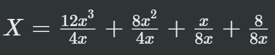

# Chapter 2 - C Instructions

## Exercise

### [A] Point out the errors, if any, in the following C statements:
1. `x = (Y + 3);` -> assuming x and y are iniitiated already then no errors.
2. `cir = 2 * 3.141593 * r;` -> no errors of cir and r are initialized already.
3. `char = '3';` -> Char is a keyword and we cannot assign value to it.
4. `4/3 * 3/14 * r * r * r = vol_of_sphere;` -> val_of_sphere should be in left side, but it is in right instead.
5. `volume = a³;` a³ is invalid.
6. `area = 1/2 * base * height;` -> no errors if area, base and height are initialized.
7. `si = p * r * n / 100;` -> no errors
8. `area of circle = 3.14 * r * r;` -> the variable `area of circle` is invalid it should be `area_of_circle`.
9. `peri_of_tri = a + b + c;` -> no errors.
10. `slope = (y2 - y1) ÷ (x2 - x1);` -> `÷` is invalid operator.
11. `3 = b = 4 = a;` -> error, we cannot assign 3 any value.
12. `count = count + 1;` -> no errors, if count is defined.
13. `char ch = '25 Apr 12';` -> error, '25 Apr 12' is a string and should be wrapped around `"` instead of `'`, and `char *ch` should be used.

### [B] Evaluate the Following expressions and show their hierarchy.
1. `ans = 5 * b * b * x -3 * a * y * y -8 * b * b * x + 10 * a * y;` (a = 3, b = 2, x = 5, y = 4 assume ans to be int) => `-84`
2. `res = 4 * a * y / c - a * y / c;` (a = 4, y = 1, c = 3, assume res to be an int) => `4`
3. `s = c + a * y * y / b;` (a = 2.2, b = 0.0, c = 4.1, y = 3.0, assume s to be an float) => `inf` 
4. `R = x * x + 2 * x + 1 /2 * x * x + x + 1` (x - 3.5, assume R to be an float) => `23.75`

### [C] Indicate the order in which the following expressions would be evaluated: 
1. `g = 10 / 5 / 2 / 1;` => 
```c
g = 10 / 5 / 2 / 1;
g = 2 / 2 / 1; // operation: /
g = 1 / 1; // operation: /
g = 1; // operation: /
```

2. `b = 3 / 2 + 5 * 4 / 3;` => 
```c
b = 3 / 2 + 5 * 4 / 3;
b = 1 + 5 * 4 / 3; // operation: /
b = 1 + 20 / 3; // operation: *
b = 1 + 6; // operation: /
b = 7; // operation: +
```

3. `a = b = c = 3 + 4;` => 
```c
a = b = c = 3 + 4; 
a = b = c = 7; // operation: + 
a = b = 7; // operation: = ( c = 7 ) 
a = 7; // operation: = ( b = 7 ) 
```

4. `x = 2 - 3 + 5 * 2 / 8 % 3;` => 
```c
x = 2 - 3 + 5 * 2 / 8 % 3; 
x = 2 - 3 + 10 / 8 % 3; // operation: * 
x = 2 - 3 + 1 % 3; // operation: / 
x = 2 - 3 + 1; // operation: % 
x = -1 + 1; // operation: - 
x = 0; // operation: + 
```

5. `z = 5 % 3 / 8 * 3 + 4;` => 
```c
z = 5 % 3 / 8 * 3 + 4;
z = 2 / 8 * 3 + 4; // operation: %
z = 0 * 3 + 4; // operation: /
z = 0 + 4; // operation: *
z = 4; // operation: +
```

6. `y = z = -3 % -8 / 2 + 7;` => 
```c
y = z = -3 % -8 / 2 + 7;
y = z = -3 % -8 / 2 + 7; // operation: %
y = z = -1 + 7; // operation: /
y = z = 6; // operation: +
```
### [D] Convert the Following algebraic expressions into Equivalent C statements:

1. 


Ans:
```c
Z = ((x + 3) * pow(x, 3)) / ((y - 4) * (y + 5)); // include <math.h> for pow()
```

2. 


Ans:
```c
R = (2 * v + 6.22 * ( c + d )) / (g + v);
```

3. 


Ans:
```c
A = (7.7 * b * ((x * y + a) / c) - (0.8 + 2 * b)) / ((x + a) * (1/y));
```

4. 


Ans:
```c
X = (
    (12 * pow(x, 3) / (4 * x)) +
    (8 * pow(x, 2) / (4 * x)) +
    (x / (8 * x)) +
    (8 / (8 * x))
); // #include <math.h> for pow()
```

### [E] What will be the Outout of the following programs:
1. 
```c
#include <stdio.h>

int main(){
    int i = 2, j = 3, k, l;
    float a, b;
    k = i / j * j;
    l = j / i * i;
    a = i / j * j;
    b = j / i * i;
    printf("%d %d %f %f\n", k, l, a, b);
    return 0;
}
```

Ans: 
```c
0 2 0.000000 2.000000
```

2. 
```c
#include <stdio.h>

int main() {
    int a, b, c, d;
    a = 2 % 5;
    b = -2 % 5;
    c = 2 % -5;
    d = -2 % -5;
    printf("a = %d, b = %d, c = %d, d = %d\n", a, b, c, d);
    return 0;
}
```

Ans:
```c
a = 2, b = -2, c = 2, d = -2
```

3.
```c
#include <stdio.h>

int main() {
    float a = 5, b = 2;
    int c, d;
    c = a % b;
    d = a / 2;
    printf("%d\n", d);
    return 0;
}
```
Ans:
```c
main.c:6:11: error: invalid operands to binary expression ('float' and 'float')
    c = a % b;
        ~ ^ ~
```

4. 
```c
#include <stdio.h>

int main() {
    printf("nn \n\n nn\n");
    printf("nn /n/n nn/n");
    return 0;
}
```
ans:
```
nn 

 nn
nn /n/n nn/n
```

5. 
```
#include <stdio.h>

int main() {
    int a, b;
    printf("Enter values of a and b");
    scanf(" %d %d " &a, &b);
    printf("a = %d b = %d\n", a, b);
    return 0;
}
```

Ans:
```c
a = <input value of a> b = <input value of b>
``` 
`<input value of a>` is the value entered by the user for a, same for b.

### [F] State weather the following statments are True or False:
1. `*` or `/`, `+` or `=` represent the correct hierarchy of arithmetic operators in C. -> `True`
2. `[]` and `{}` can e used in Arithmetic instructions. -> `False`
3. Hierarchy decides which operator is used first. -> `True`
4. In C, Arithmetic instructions cannot contain constants on left side of =. -> `False`
5. In C `**` operator is used for exponentiation. -> `False`
6. `%` operator cannot be used with floats. -> `True`

### [G] Fill in the blanks:
1. In `y = 10 * x / 2 + z;` <u>&nbsp;`*`&nbsp;</u> operation will be performed first.
2. If **a** is an integer variable, `a = 11 / 2;` will store <u>&nbsp;`5`&nbsp;</u> in **a**.
3. The expression, `a = 22 / 7 * 5 / 3;` would evaluate to <u> &nbsp;`5` &nbsp;</u>. 
4. The expression, `x = -7 % 2 - 8` would evaluate to <u>&nbsp;`-11`&nbsp;</u>. 
5. If **d** is a **float** the operation `d = 2 / 7.0` would store <u>&nbsp;`0.285714`&nbsp;</u> in **d**.
