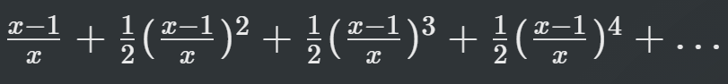

## [C] Attempt the following:

a. Write a program to print all prime numbers from 1 to 300. (Hint: Use neted loops, `break` and `continue`) [Solution](./a.c)

b. Write a program to add first seven terms of the following series using a `for` loop. [Solution](./b.c)

`1/1! + 2/2! + 3/3! +`

c. Write a program to generate all cominations of 1, 2, 3 using `for` loop. [Solution](./c.c)

d. Write a program to print the multiplication table of the number entered by the user. The table should get displayed in the following form: [Solution](./d.c)

`29 * 1 = 29`

`29 * 2 = 58`

...

e. According to a study, the approximate level of intelligence of a person can be calculated using the following formula:

`i = 2 + ( y + 0.5x)`

Write a program that will roduce a table of values of `i`, `y` and `x`, where `y` varies from 1 to 6, and for each value of `y`, `x` varies from 5.5 to 12.5 in steps of 0.5. [Solution](./e.c)

f. When interest compounds `q` times per year at an annual rate of `r` % for `n` years, the principal `p` compounds to an amount `a` as per the following formula:

a = p ( 1 + r / q )^(nq)

Write a program to read 10 sets of `p`, `r`, `n` & `q` and calculate the corresponding a's. [Solution](./f.c)

g. The natural logarithm can be approximated by the following series. 

if `x` is input through the keyboard, write a program to calculate the sum of first seven terms of this series. [Solution](./g.c)

h. Write a program to generate all Pythagorean Triplets with side length less than or equal to 30. [Solution](./h.c)

i. Population of a town today is 100,000. The population has increased steadily at the rate of 10% per year for the last 10 years. Write a program to determine the population at the end of each year in the last decade. [Solution](./i.c)

j. Ramanujan number is the smallest number that can be expresssed as sum of two cubes in two different ways. Write a program to print all such numbers up to a reasonable limit. [Solution](./j.c)

k. Write a program to print 24 hours of day with sutable suffixes like AM, P, Noon and Midnight. [Solution](./k.c)

l. Write a program to produce the following output:
```
            1
        2       3
    4       5       6
7       8       9       10
```
[Solution](./l.c)
