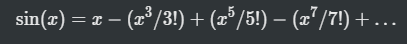

## [C] Attempt the following:

a. Write a function that recieves 5 integers and returns the sum, average and standard deviation of these numbers. Call the function from `main()` and print the results in `main()`. [Solution](./a.c)

b. Write a function that recieves marks obtained by a student in 3 subjects and returns the average and percentage of these marks. Call this function from `main()` and print the results in `main()`. [Solution](./b.c)

c. Write a C function to evaluate the series

upto 10 terms [Solution](./c.c)
